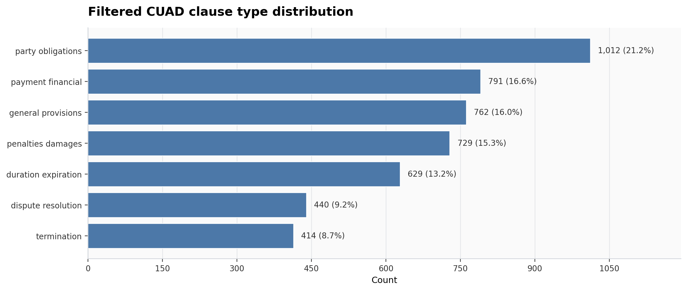
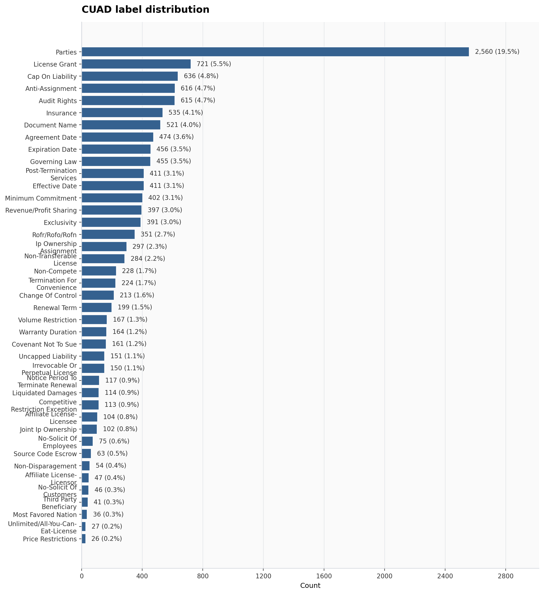
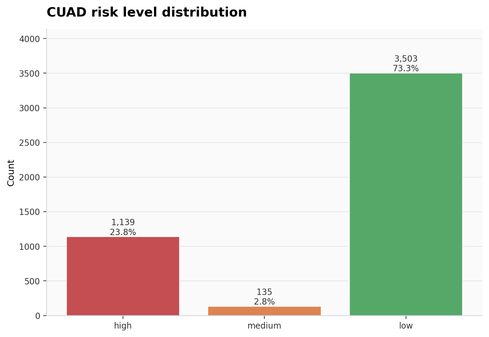
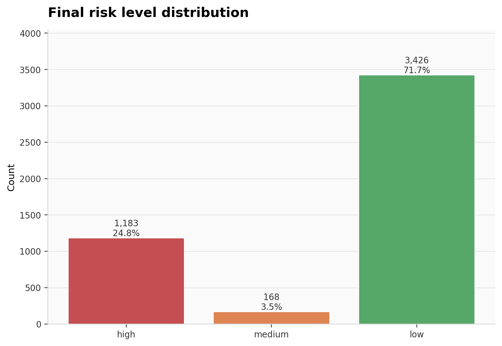
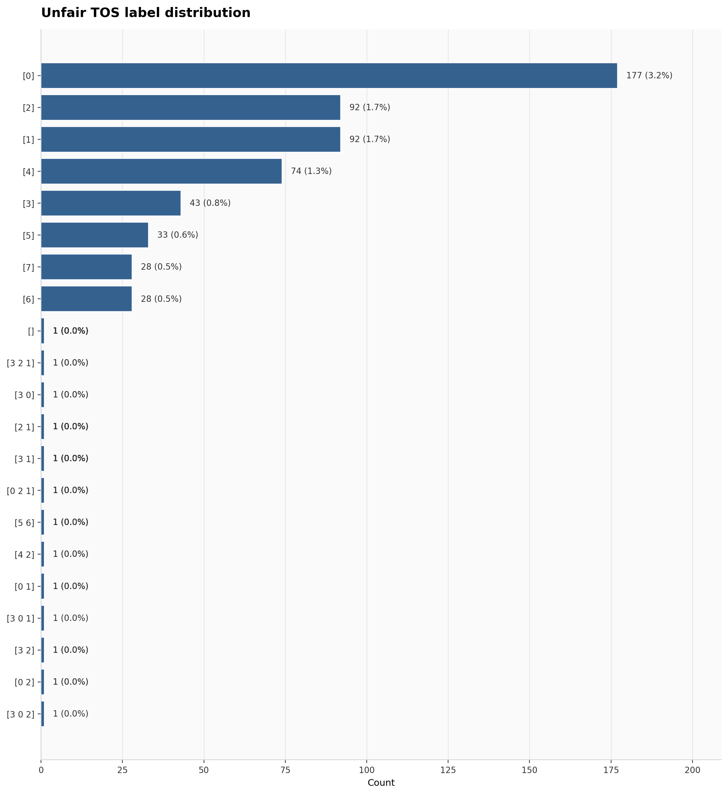
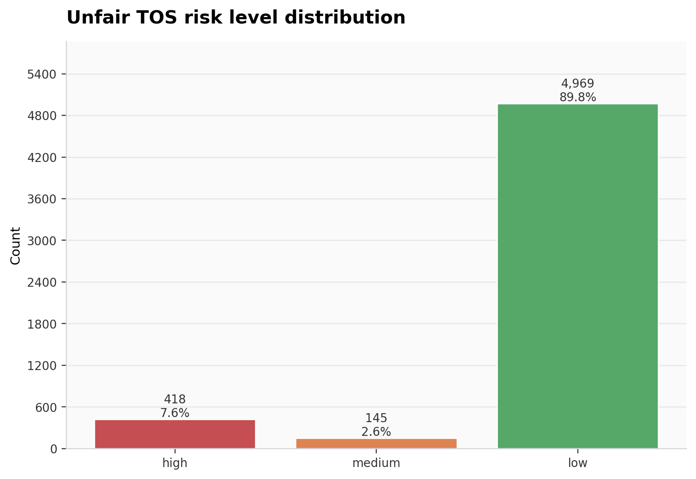

# Project Plots

This repository contains various plots generated during the analysis process. Below is a description of each plot available in the `plots` folder:

## Plots

### 1. CUAD Clause Types

This plot visualizes the distribution of clause types in the CUAD dataset. It provides insights into the frequency of different clause categories.

### 2. CUAD Labels

This plot shows the distribution of labels in the CUAD dataset. It helps in understanding the labeling structure and the prevalence of each label.

### 3. CUAD Phase 2 Risk Levels

This plot illustrates the risk levels identified in Phase 2 of the CUAD dataset analysis. It highlights the categorization of risks.

### 4. CUAD Risk Levels

This plot provides an overview of the risk levels across the CUAD dataset. It is useful for comparing risk distributions.

### 5. Unfair Terms of Service Labels

This plot depicts the labels associated with unfair terms of service. It aids in identifying common unfair practices.

### 6. Unfair Terms of Service Risk Levels

This plot shows the risk levels related to unfair terms of service. It is useful for assessing the severity of unfair practices.

---

Feel free to explore the plots for a better understanding of the dataset and analysis outcomes.
