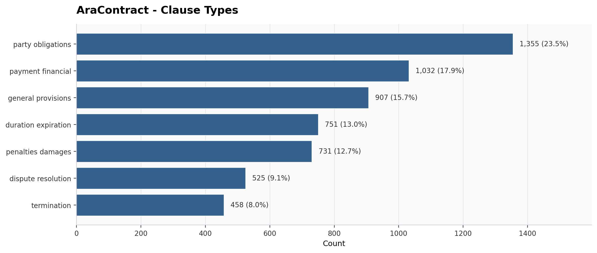
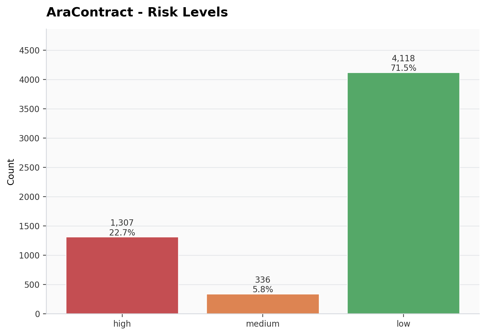
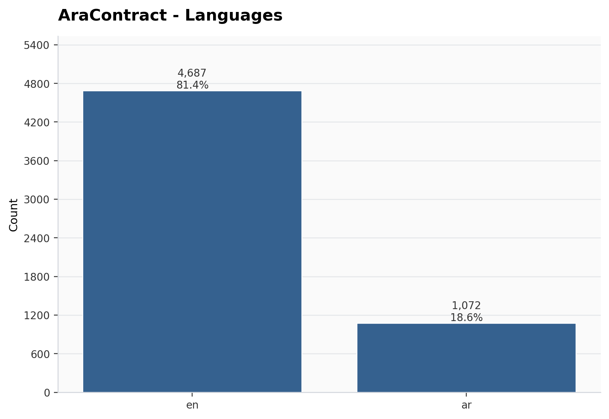
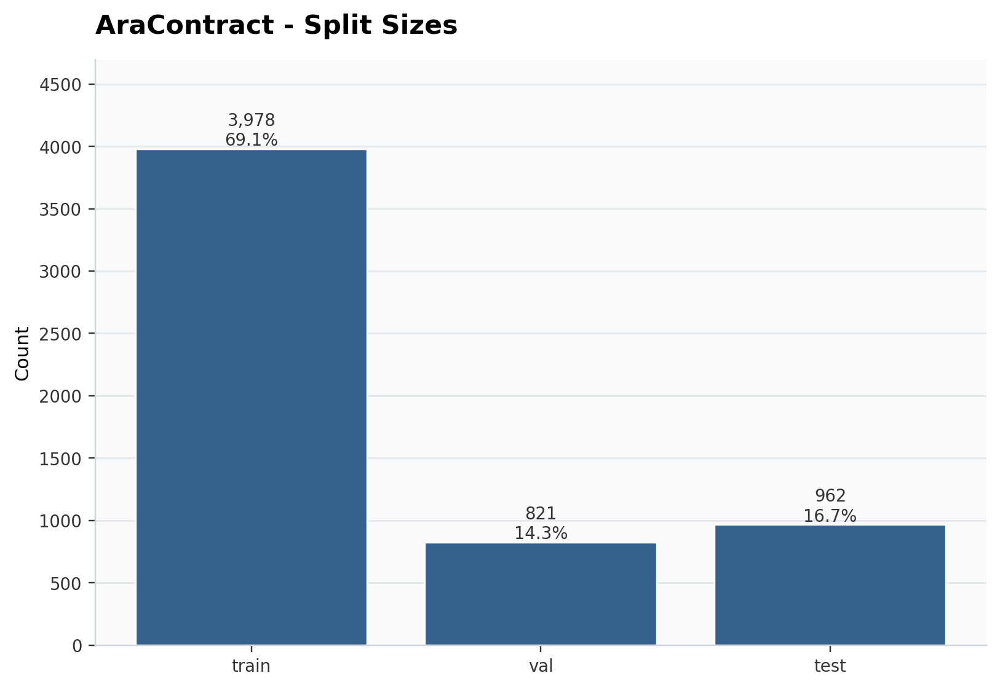

# Project Plots

This repository contains various plots generated during the analysis process. Below is a description of each plot available in the `plots` folder:

## Plots

### 1. CUAD Clause Types


This plot visualizes the distribution of clause types in the CUAD dataset. It provides insights into the frequency of different clause categories.

### 2. CUAD Labels


This plot shows the distribution of labels in the CUAD dataset. It helps in understanding the labeling structure and the prevalence of each label.

### 3. CUAD Phase 2 Risk Levels


This plot illustrates the risk levels identified in Phase 2 of the CUAD dataset analysis. It highlights the categorization of risks.

### 4. CUAD Risk Levels


This plot provides an overview of the risk levels across the CUAD dataset. It is useful for comparing risk distributions.

### 5. Unfair Terms of Service Labels


This plot depicts the labels associated with unfair terms of service. It aids in identifying common unfair practices.

### 6. Unfair Terms of Service Risk Levels


This plot shows the risk levels related to unfair terms of service. It is useful for assessing the severity of unfair practices.

---

## AraContract (Merged Dataset)

### 7. AraContract Clause Types


This plot summarizes the clause type distribution in the final merged dataset.

### 8. AraContract Risk Levels


This plot shows the risk level distribution across all merged clauses.

### 9. AraContract Languages


This plot shows the language split between English (CUAD) and Arabic (Syrian contracts).

### 10. AraContract Split Sizes


This plot shows the train/val/test split sizes after Step 5.

---

## Installation

To set up the environment and install the required libraries, follow these steps:

1. Create a virtual environment:

   ```bash
   python3 -m venv .venv
   ```

2. Activate the virtual environment:

   ```bash
   source .venv/bin/activate
   ```

3. Install the required libraries:

   ```bash
   pip install -r requirements.txt
   ```

---

## Pipeline (All Steps + Outputs)

### Step 1 - Build CUAD Phase 1

```bash
python step1.py
```

Outputs:

- cuad_phase1.jsonl
- plots/cuad_labels.png
- plots/cuad_clause_types.png

### Step 2-0 - Unfair-ToS label and risk plots

```bash
python step2-0.py
```

Outputs:

- plots/unfair_tos_labels.png
- plots/unfair_tos_risk_levels.png

### Step 2-1 - Train risk classifier and label CUAD

```bash
python step2-1.py
```

Outputs:

- cuad_phase2.jsonl
- plots/cuad_phase2_risk_levels.png

### Step 3 - Fix CUAD risk levels

```bash
python step3.py
```

Outputs:

- cuad_phase2_fixed.jsonl
- plots/cuad_risk_levels.png

### Step 4 - Extract Arabic clauses from scraped contracts

```bash
python step4.py --input scrap/contracts_dataset --output arabic_phase3.jsonl --manifest scrap/contracts_dataset/manifest.json
```

Outputs:

- arabic_phase3.jsonl

### Step 5 - Merge and split dataset

```bash
python step5.py --cuad cuad_phase2_fixed.jsonl --arabic arabic_phase3.jsonl --outdir claude
```

Outputs (inside the output directory):

- aracontract_final.jsonl
- aracontract_train.jsonl
- aracontract_val.jsonl
- aracontract_test.jsonl
- aracontract_stats.json

### Step 6 - Plot Syrian-only data

```bash
python step6.py --input arabic_phase3.jsonl --manifest scrap/contracts_dataset/manifest.json
```

Outputs:

- plots/syrian_clause_types.png
- plots/syrian_risk_levels.png
- plots/syrian_clause_categories.png
- plots/syrian_contract_categories.png

### Step 7 - Plot merged dataset and splits

```bash
python step7.py --input-dir claude
```

Outputs:

- plots/aracontract_clause_types.png
- plots/aracontract_risk_levels.png
- plots/aracontract_languages.png
- plots/aracontract_sources.png
- plots/aracontract_split_sizes.png

Feel free to explore the plots for a better understanding of the dataset and analysis outcomes.
